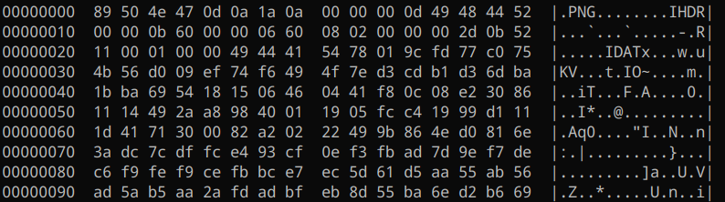

# Cryptohack - Bean Counter
This challenge features a .png image being encrypted by a 'custom' implementation of CTR mode on AES, as shown by the code below:

```
from Crypto.Cipher import AES


KEY = ?


class StepUpCounter(object):
    def __init__(self, step_up=False):
        self.value = os.urandom(16).hex()
        self.step = 1
        self.stup = step_up

    def increment(self):
        if self.stup:
            self.newIV = hex(int(self.value, 16) + self.step)
        else:
            self.newIV = hex(int(self.value, 16) - self.stup)
        self.value = self.newIV[2:len(self.newIV)]
        return bytes.fromhex(self.value.zfill(32))

    def __repr__(self):
        self.increment()
        return self.value


@chal.route('/bean_counter/encrypt/')
def encrypt():
    cipher = AES.new(KEY, AES.MODE_ECB)
    ctr = StepUpCounter()

    out = []
    with open("challenge_files/bean_flag.png", 'rb') as f:
        block = f.read(16)
        while block:
            keystream = cipher.encrypt(ctr.increment())
            xored = [a^b for a, b in zip(block, keystream)]
            out.append(bytes(xored).hex())
            block = f.read(16)

    return {"encrypted": ''.join(out)}
```
CTR mode, when properly implemented, works by applying AES encryption to a concatenation of a nonce with an incrementing counter value, which is then XORed with each plaintext block. Since AES is applied to each concatenation of the nonce with the counter, the resulting keystream is unpredictable.

The above code builds upon PyCrypto's ECB mode for a custom CTR implementation, but a quick look at the `StepUpCounter` class reveals that the counter is poorly implemented - Note how `self.stup` will always be False, which results in the counter never being altered. This means that the same keystream will be used for each plaintext block being encrypted. Thus, by knowing any of the plaintext blocks that were encrypted by the code, we can discover the keystream that was used to XOR the rest of the file and decrypt the image fully.

Fortunately, PNG files follow a structure in which their first 16 bytes - the size of the first block - are always known to us. You can verify this by opening any PNG image in a hex viewer:



- `89 50 4E 47 0D 0A 1A 0A`: First 8 bytes consisting of the magic number
- `00 00 00 0d`: IHDR Chunk length (big endian), always 13 bytes
- `49 48 44 52`: IHDR Chunk type - literally just 'IHDR' in ASCII.

Therefore, we may use the following code to write the decrypted image to our working directory:
```
import requests

r = requests.get('https://aes.cryptohack.org/bean_counter/encrypt/')
d = r.json()
ciphertext = d['encrypted']

block1 = ciphertext[:32]
png = "89504e470d0a1a0a0000000d49484452"

png_bytes = bytes.fromhex(png)
block1_bytes = bytes.fromhex(block1)

keystream = bytes([a^b for a,b in zip(png_bytes, block1_bytes)])

ciphertext_blocks = [ciphertext[i:i+32] for i in range(0, len(ciphertext), 32)]

with open("flag.png", 'wb') as f:
    for block in ciphertext_blocks:
        block = bytes.fromhex(block)
        plain = bytes([a^b for a,b in zip(block, keystream)])
        f.write(plain)
```
