# Flare On 11 - Checksum
Opening the file, we can see that it asks us to compute the result of an addition:

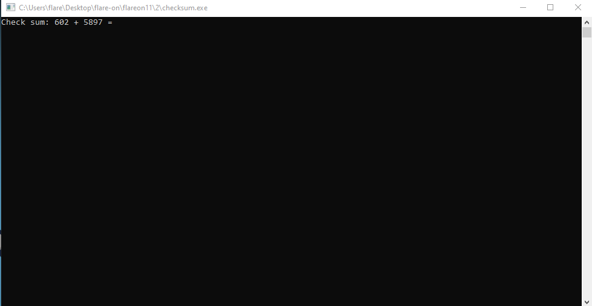

And then some more additions, until eventually we are asked for a "Checksum":

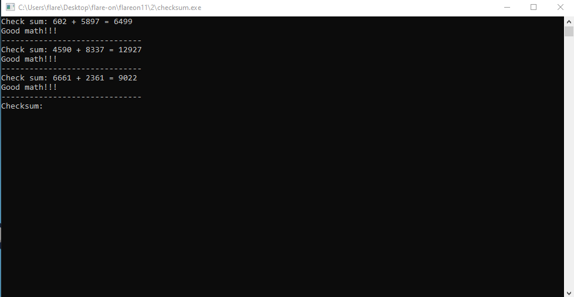

We can't determine this value without further analysing the binary. By loading the program on Detect It Easy, we notice that it's a Go binary:

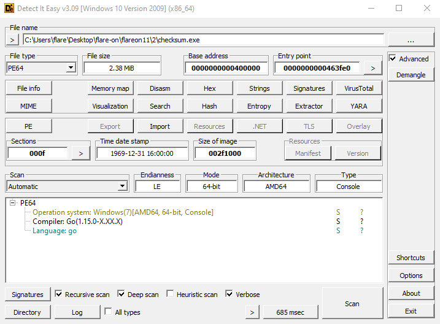

So, we need to disassemble the program (I recommend using Ghidra for this challenge) and look for the `main.main` function to analyse the binary's control flow. Searching for the string `main.main` can help us quickly find the main function:

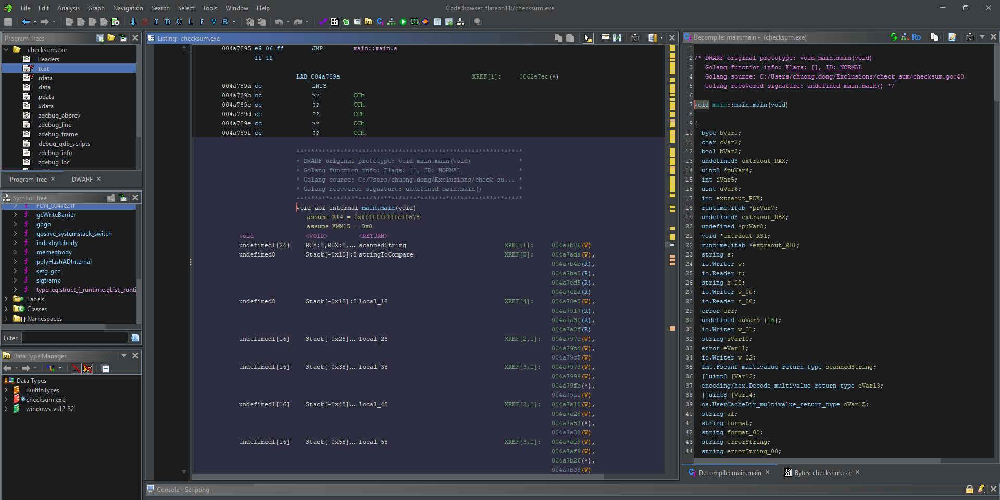

For the additions, we can see that the program generates two random numbers and scans the user's input to check whether the given answer is correct, printing "Try again! ;)" to the screen if the given answer is incorrect:

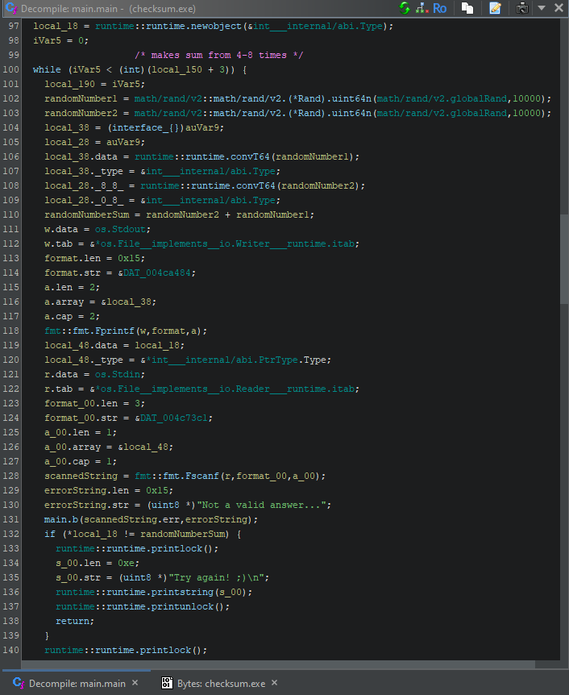

Eventually, the program prompts the user for a "Checksum" and calls the function `main.a` with the value written by the user as an argument:

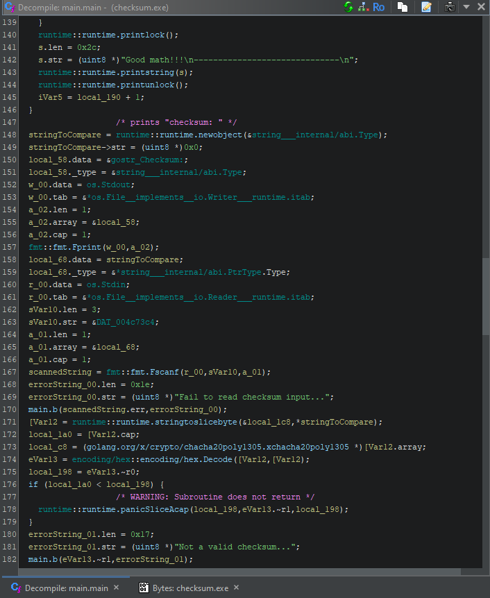
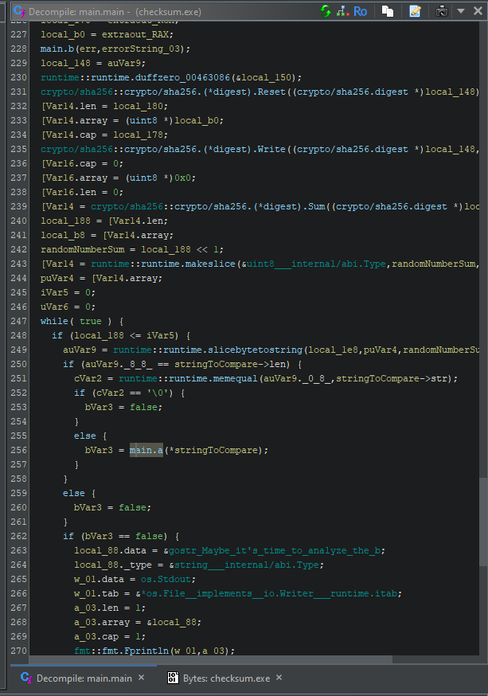

The `main.a` function XORs our "Checksum:" value with a key, "FlareOn2024", then base64 encodes it and compares it against a hard-coded base64 encoded value.

Note the `keyIterator = iterator + (iterator / 0xb + (iterator >> 0x3f)) * -0xb` expression, which is essentially an obfuscated `iterator % key_length`, meant to reset the key "FlareOn2024" (of length 11) back to its beginning upon reaching its end as we XOR the checksum with the key. The term `(iterator / 0xb + (iterator >> 0x3f)) * -0xb` will result in 0 for values less than 11, then -11 for values between 12 and 21, etc

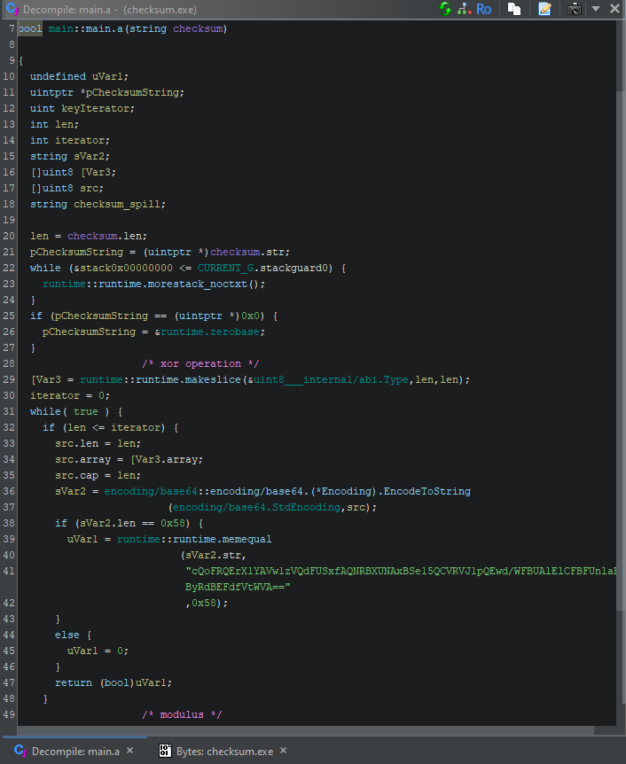
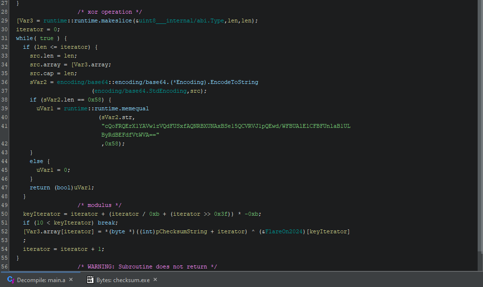

Therefore, we can decode the value required by the program and, due to XOR's self inverse property, re-apply the key to find what the correct checksum value is.

```python
import base64

base64string = "cQoFRQErX1YAVw1zVQdFUSxfAQNRBXUNAxBSe15QCVRVJ1pQEwd/WFBUAlElCFBFUnlaB1ULByRdBEFdfVtWVA=="

decoded = base64.b64decode(base64string)

key = "FlareOn2024"
keylen = len(key)

original_bytes = bytearray()
for i in range(len(decoded)):
    key_byte = ord(key[i % keylen])
    original_bytes.append(decoded[i] ^ key_byte)

print(original_bytes)
```
output:
`bytearray(b'7fd7dd1d0e959f74c133c13abb740b9faa61ab06bd0ecd177645e93b1e3825dd')`

From the ending of the `main.main` function, we notice that upon entering the correct checksum value, the program will save a `REAL_FLAREON_FLAG.JPG` to the user's `os.UserCacheDir()` directory. On Windows, this will be the `C:\Users\<username>\AppData\Local` directory.

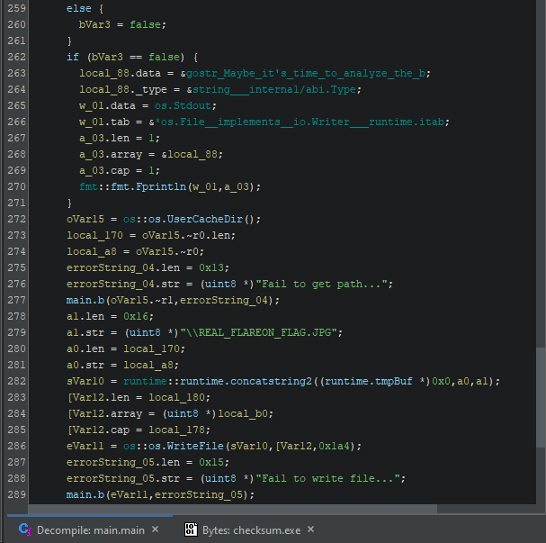

This image contains the flag.

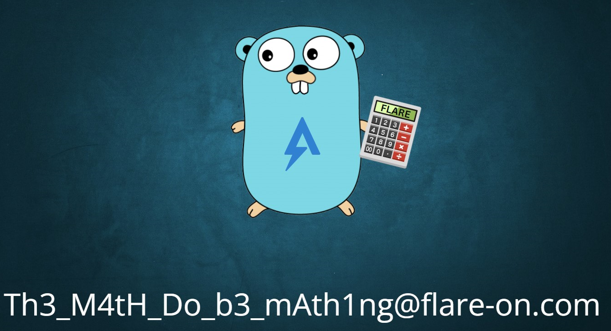