# Flare On 11 - Checksum
This was the 2nd challenge of Mandiant’s Flare-On CTF in 2024. It’s a fairly straightforward reverse engineering challenge, and obfuscation is mostly derived from the Go language itself than any specific anti-analysis techniques.

Opening the file, we can see that it asks us to compute the result of an addition:

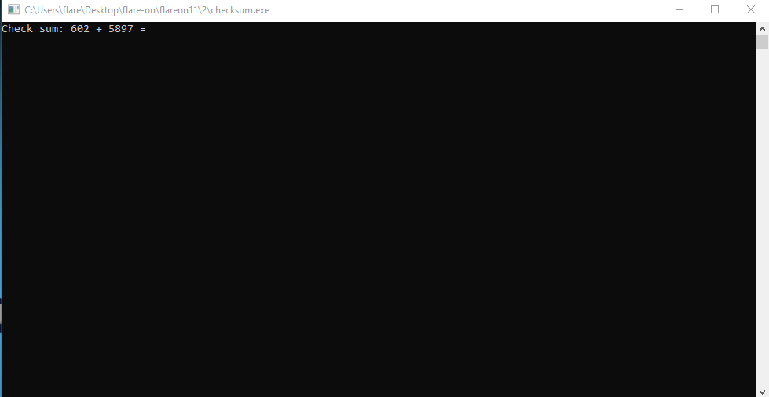

And then some more additions, until eventually we are asked for a "Checksum":

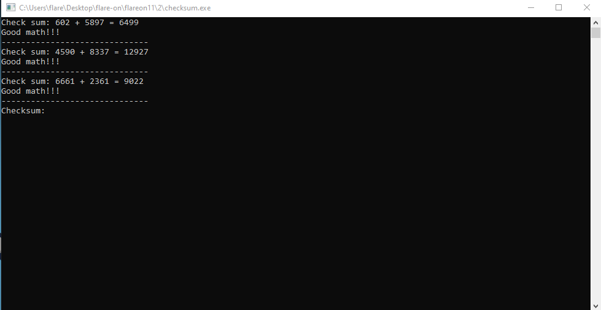

We can't determine this value without disassembling the program. By loading the executable on Detect It Easy, we notice that it's a Golang binary:

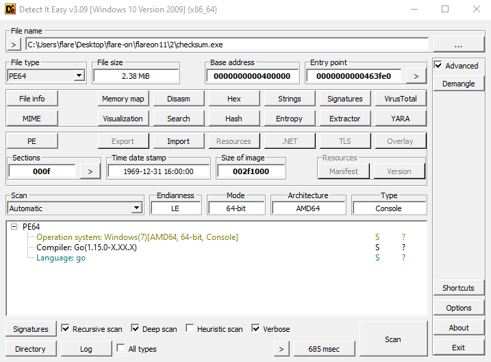

So, we need to disassemble the program (I recommend using Ghidra for this challenge) and look for the `main.main` function to analyse the binary's control flow. Searching for the string `main.main` can help us quickly find the main function:

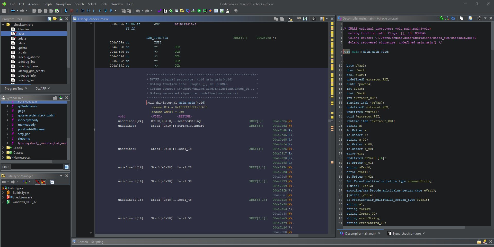

For the additions, we can see that the program generates two random numbers and scans the user's input to check whether the given answer for the sum is correct, printing "Try again! ;)" to the screen and exiting in the case of an incorrect answer. 

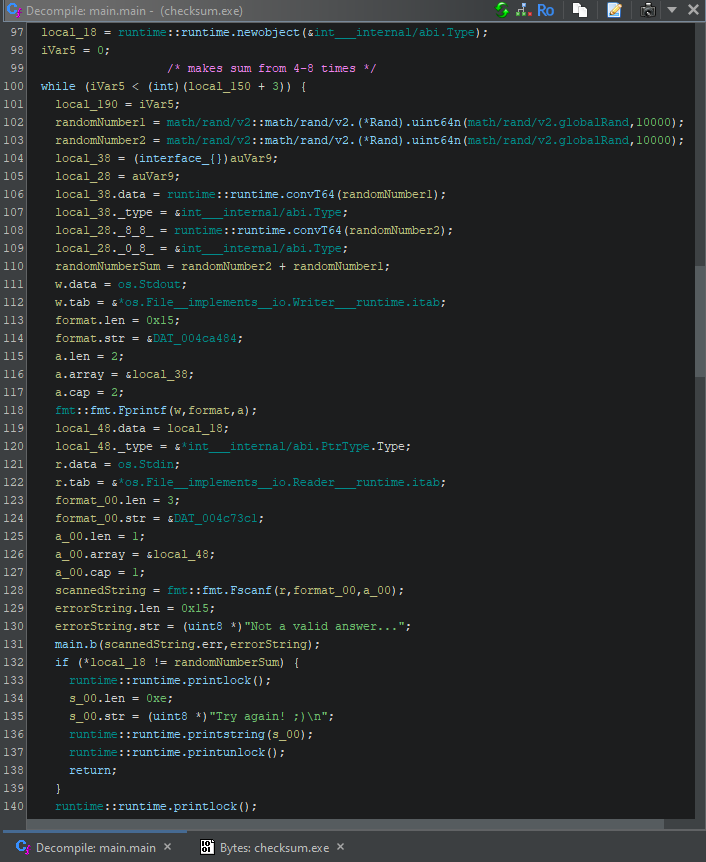

Eventually, the program prompts the user for a "Checksum" and calls the function `main.a` with the value written by the user as an argument:

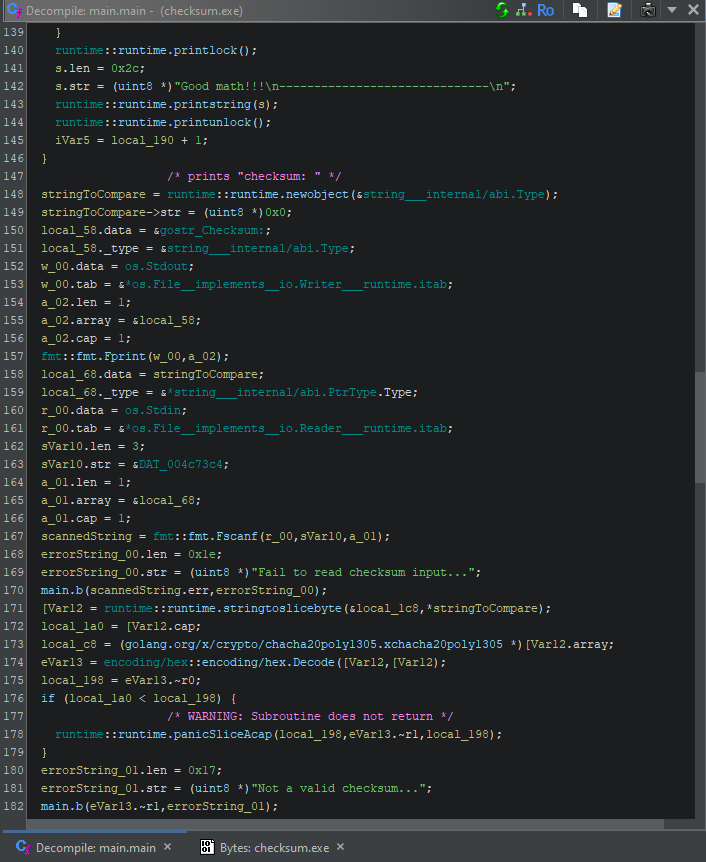
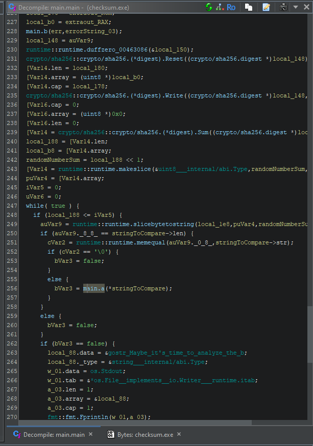

The `main.a` function XORs our "Checksum:" value with a key, "FlareOn2024", then base64 encodes it and compares it against a hard-coded base64 encoded value.

Note the `keyIterator = iterator + (iterator / 0xb + (iterator >> 0x3f)) * -0xb` expression, which is essentially an obfuscated `iterator % key_length`, meant to reset the key "FlareOn2024" (of length 11) back to its beginning upon reaching its end as we XOR the checksum with the key. The term `(iterator / 0xb + (iterator >> 0x3f)) * -0xb` will result in 0 for values less than 11, then -11 for values between 12 and 21, etc. 

`(iterator >> 0x3f)` shifts the value in `iterator` to the right by 63 bits and would only result in something greater than 0 after $2^{64}$ iterations, which is unlikely as it would require a string in excess of 18 exabytes.

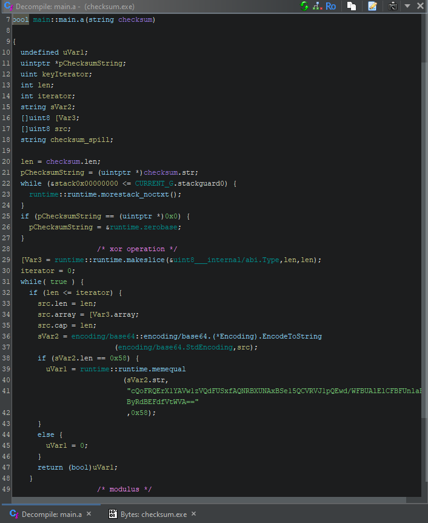
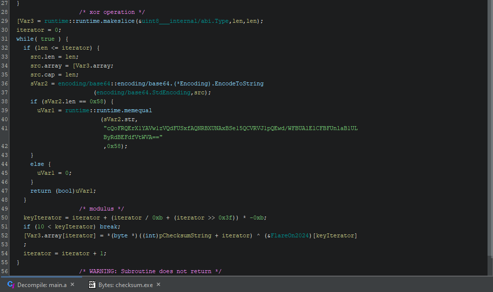

Therefore, we can decode the value required by the program and, due to XOR's self inverse property, re-apply the key to find what the correct checksum value is.

```python
import base64

base64string = "cQoFRQErX1YAVw1zVQdFUSxfAQNRBXUNAxBSe15QCVRVJ1pQEwd/WFBUAlElCFBFUnlaB1ULByRdBEFdfVtWVA=="

decoded = base64.b64decode(base64string)

key = "FlareOn2024"
keylen = len(key)

original_bytes = bytearray()
for i in range(len(decoded)):
    key_byte = ord(key[i % keylen])
    original_bytes.append(decoded[i] ^ key_byte)

print(original_bytes)
```
output:
`bytearray(b'7fd7dd1d0e959f74c133c13abb740b9faa61ab06bd0ecd177645e93b1e3825dd')`

From the ending of the `main.main` function, we notice that upon entering the correct checksum value, the program will save a `REAL_FLAREON_FLAG.JPG` to the user's `os.UserCacheDir()` directory. For Windows systems, the image will be saved to `C:\Users\<username>\AppData\Local\REAL_FLAREON_FLAG.JPG`.

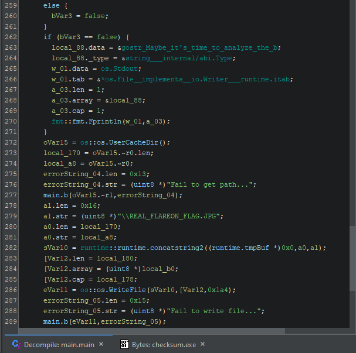

This image contains the flag.

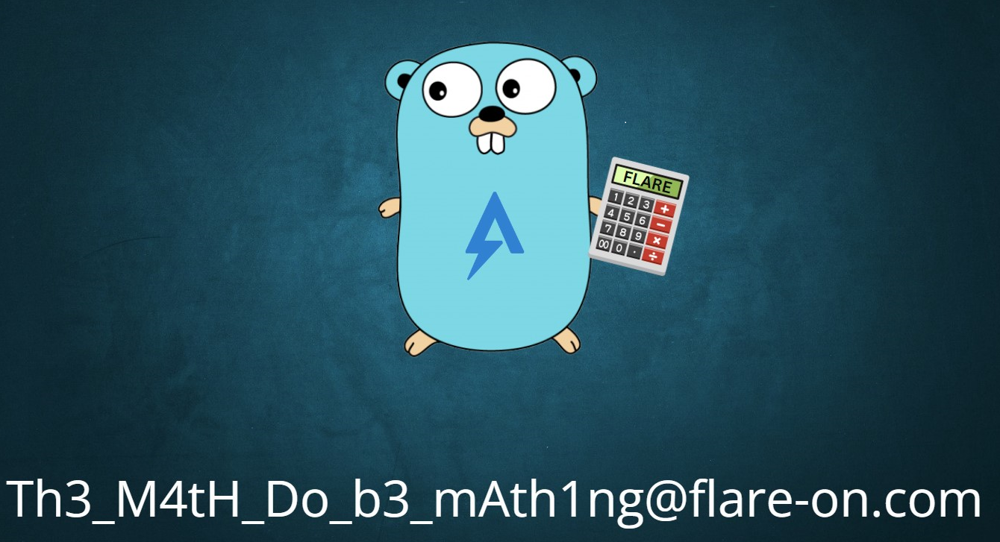