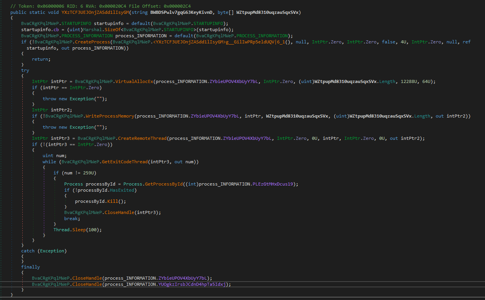

# Coyote Trojan

## Overview
- .NET Remote Access Tool
- Seen distributed via Whatsapp on a file named `ComprovanteBradesco_2025-94812.147.zip`, containing a signed ICS Unattend Utility executable and a powershell script with a .pdf.lnk extension

## Sample 
- .zip: `771119311beee7e07aa000ada7c281866acd2e4cbdf9099501a3b194081eb4b3` [VirusTotal](https://www.virustotal.com/gui/file/771119311beee7e07aa000ada7c281866acd2e4cbdf9099501a3b194081eb4b3)
- ".pdf.lnk" powershell script: `151135f4817ce54de14346407a8e84f5de78a7b1a10ffb1f53db73e2286dd976` [VirusTotal](https://www.virustotal.com/gui/file/151135f4817ce54de14346407a8e84f5de78a7b1a10ffb1f53db73e2286dd976)
- .dll: `151dc1f3b41e479ce8145de0dfd3940ba0c9e16576b16d87fc52c2851428e5f7` [UnpacMe](https://www.unpac.me/results/dcd5848d-7a2f-4c62-bab0-6c47e675d8fa) [VirusTotal](https://www.virustotal.com/gui/file/151dc1f3b41e479ce8145de0dfd3940ba0c9e16576b16d87fc52c2851428e5f7)
- .bin shellcode: `4e37814b574d97b89de4a1841ddf718882164930fa5ce75a718bb98531cc1b24` [VirusTotal](https://www.virustotal.com/gui/file/4e37814b574d97b89de4a1841ddf718882164930fa5ce75a718bb98531cc1b24)

## Analysis
Powershell runs the script located at `hxxps[://]qfyivt[.]animaliaoqisso[.]com/mckpywjwxgrn`, which contains two encoded binaries: a malicious .dll file and a .bin shellcode.
Each binary is decoded by being dynamically divided by an int value (156 for the .dll and 198 for the .bin)
```powershell
function rFnQp { param([int[]]$NmGwG,[int]$IbZzNQ) $r=New-Object byte[] $NmGwG.Length;for($i=0;$i -lt $NmGwG.Length;$i++){$r[$i]=[byte]([math]::Floor($NmGwG[$i]/$IbZzNQ))};$r }

$YlkytI = [int[]](12012,14040,22464,...)
$YlkytIDec = rFnQp -NmGwG $YlkytI -IbZzNQ 156

$JBzyQ = [int[]](45936,38016,42174,...)
$JBzyQDec = rFnQp -NmGwG $JBzyQ -IbZzNQ 198
```
We can dump the two binaries by decoding each byte in the arrays and saving the output to a file:
```python
IbZzNQ_YlkytI = 156
IbZzNQ_JBzyQ = 198

YlkytIDec = bytearray(n // IbZzNQ_YlkytI for n in YlkytI)
JBzyQDec = bytearray(n // IbZzNQ_JBzyQ for n in JBzyQ)

with open("decoded_YlkytI.dll", "wb") as f:
    f.write(YlkytIDec)

with open("decoded_JBzyQ.bin", "wb") as f:
    f.write(JBzyQDec)
```

The script then calls  the `YXzTCF3UEJOnjZASdd1lIsyGM` method inside the .dll, providing the shellcode as an argument:
```powershell
[System.AppDomain]::CurrentDomain.Load([Byte[]]$YlkytIDec).GetType("BvaCRgKPqlMWeP.BvaCRgKPqlMWeP").GetMethod("YXzTCF3UEJOnjZASdd1lIsyGM").Invoke($null, [Object[]]("riRgiWBjWKRniX56bxatlI8SojlnKvAi6ToDpU7CooIuiNGAWdiwd7M9uIwXhEEIoCPZewlBzwjVWuBLPKnH2l34JZzBcwXRVfVsKdKPeCAixf2LkmZLet2tNKnsuDGkCvl9Syi5OizNPOqLrf6TIxasZGB1UpWJBzzmscLyUIE0ULvUke7we8M2a4MMTSwrnDQN77YlN5oxZKGsdIH2PoMyasTn9NVPYBNgWr8J0gWGXEClXRjUyBZiusstBw29GWittoWSCBql28e0z3wU9R5Hi8dsnsBDgJF3wrvH8Nl0elbt92IDJEr7NX3FiKcU5yPdiu2BmGJ8xGZPUCump3KQd7sFtCz2cmO4ViF54dPyp8rWMnzts3puxlc6H4EfyltNa74Xc4QcLJNY35xTpGEuvzh08Rxd4QC8cGyunPkRjpEHrLmeFu6ihYnJIkLq7K5HjL2As1rJ96srG0y0PNLZQPDkvp40BuA9g8xR9a78xUNyfjqY0QYKrVhgmppmyo4kFObjnD2D4HzxcN8", [Byte[]]$JBzyQDec));
```

The large string passed as an argument to the method is possibly a red herring as it doesn't have any functionality inside the malware:


 The malware chooses one of the following legitimate files from `C:\\Windows\\Microsoft.NET\\Framework\\v4.0.30319\\`:
  
```
aspnet_regsql
aspnet_compiler
RegAsm
ilasm
AppLaunch
csc
InstallUtil
ngentask
```

Which is then copied to the location at

`C:\ProgramData\{random 4 lowercase letters}\{random 5 lowercase letters}º.exe`.

The malware then proceeds to create a process at this file, allocate virtual memory, write the shellcode into memory and execute it with `CreateRemoteThread`.