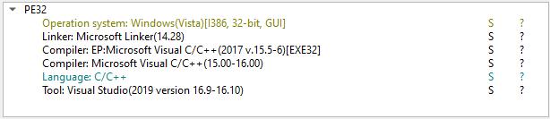

# SpectreRAT v10 - pt1

This is an analysis of a sample of SpectreRAT that was featured in an [OALABS](https://www.openanalysis.net/) stream. We'll look at decoding the strings and examining the malware's functionality.

SHA256 hash: `734a22c413872a8b5f6fc5342261b9ff2c256c1891bb258747ff000df960ce4f`

When uploading the sample to [any.run](https://any.run/), we can observe the sample's process making GET requests to the URL `hxxp[://]gatescarmencitamario[.]com/v10/jnml[.]php?nico=6`, which is presumably a C2 server.

This sample is coded in C++. We can verify this with DetectItEasy:


Upon loading the program in Ghidra and looking at cross-references to the first string name we find, we notice that it's being decoded with some single-byte XOR just prior to receiving the `std::string` object assigning in `mw_string_assign`:


In the above decompilation, `FUN_00135fdc()` fetches the address of the first element of the encoded string, which is then decoded and passed to the function that assigns it the `std::string` object.

One thing to note is how C++ variables are initialized. In C++, global and static objects are guaranteed to be initialized before the program starts execution at `main()`, during either the static or dynamic initialization phases. The initialization process dictates that simple types such as integers and pointers are initialized at compile-time, during the static initialization phase. A class like `std::string`, meanwhile, requires its constructor to allocate memory and copy the string into it. This cannot be done at compile-time and thus is handled at runtime, during the dynamic initialization phase which also happens before `main()`. 

With the knowledge that the `std::string` constructor will be invoked before `main()`, we can rebase Ghidra's base address to match that of x32dbg's and set a breakpoint in the `mw_string_assign` function in x32dbg to read the strings as they pass on their way to receive the `std::string` assigning.


Note that `mw_string_assign` uses a `__thiscall` calling convention, meaning the `this` pointer is passed via the ECX register and the arguments are passed on the stack. So for our `mw_string_assign` breakpoint, the ECX register will hold the address of the string and the first argument passed on the stack (`[esp+4]` or `[ebp-8]` for x86) will hold the decoded string. We can setup our breakpoint in x32dbg like so:


After setting up a breakpoint in `WinMain` (to ensure the program doesn't actually execute), we can dump the strings by looking at the log:


We can then use the dump in a Ghidra script to add these strings to their respective addresses to continue our static analysis - In my case, for a base address of 0x00BC0000:

```
strings = {
0xC10A7C: "76E894005c2DE86E40b032a0931D2ABC05C6eB36ACb1C18F5b640aD24Bbc9454",
0x6FFCD4: "OzYuOT02LjY1LDUw",
0x6FFCEC: "ZWN0bXtjYXJtZ2xjaXxjbWFya28sYW9t",
0x6FFD04: "Y2xnbWRpbmFpaGRmZnpnZHJpYWssYW9t",
0xC1098C: "1950BC4F01",
0xC106F8: "17B4C29833",
0xC1080C: "EEE592271B",
0xC10590: "CullinetProgram",
0xC10B90: "680FDC",
0xC10578: "ACDB39",
0xC10A34: "09-23",
0xC10860: "rhnu.dll",
0xC10650: "nyxhv",
0xC105D8: "B3C830CA-4433-CC3A-6737",
0xC109A4: "uhapy",
0xC108F0: "http://manjitaugustuswaters.com",
0xC10740: "jnml.php",
0xC10638: "grfq.php",
0xC10698: "tsml.zip",
0xC10A4C: "tsml_nonir.zip",
0xC10BF0: "wvxk.zip",
0xC10B0C: "wvxk_x64.zip",
0xC10B78: "wsau.exe",
0xC105C0: "nico=",
0xC10B3C: "&yfat=",
0xC10A04: "&zbce=",
0xC10AAC: "&qiob=",
0xC108A8: "&jwrb=",
0xC107AC: "&nsmb=",
0xC106B0: "&inau=",
0xC10608: "&wpof=",
0xC1077C: "&chja=",
0xC109BC: "&ehin=",
0xC108C0: "&vmzn=",
0xC109EC: "&ouej=",
0xC10944: "&rzya=",
0xC10890: "&cdyt=",
0xC1092C: "&rich=",
0xC10794: "&clsx=",
0xC10ADC: "&hwqy=",
0xC105A8: "?selk=",
0xC10BD8: "vdle",
0xC10BC0: "down/",
0xC10560: "\\Microsoft\\Windows\\Start Menu\\Programs\\Startup\\",
0xC1083C: "nircmdc.exe",
0xC10BA8: "zip.exe",
0xC10680: "/c ping localhost -n 6 > nul &",
0xC10974: "/c ping localhost -n 10 > nul &",
0xC105F0: "cout",
0xC107F4: "http://",
0xC10AC4: "true",
0xC10908: "false",
0xC109D4: "void",
0xC10A94: ".asd",
0xC10620: "[@]",
0xC108D8: "[|]",
0xC107DC: "[*]",
0xC10710: ".png",
0xC10668: ".exe",
0xC10B54: ".lnk",
0xC10764: ".vbs",
0xC10B24: ".txt",
0xC10728: ".7z",
0xC106E0: ".bak",
0xC10A1C: " --headless=old --disable-gpu --remote-debugging-port=0 ",
0xC107C4: "MyTasks\\"
}

for address, decoded_str in strings.items():
    addr = toAddr(address)
    createLabel(addr, decoded_str.replace(' ','_'), False)
    setEOLComment(addr, decoded_str)
```

This allows us to look at how each string is used in the code itself.